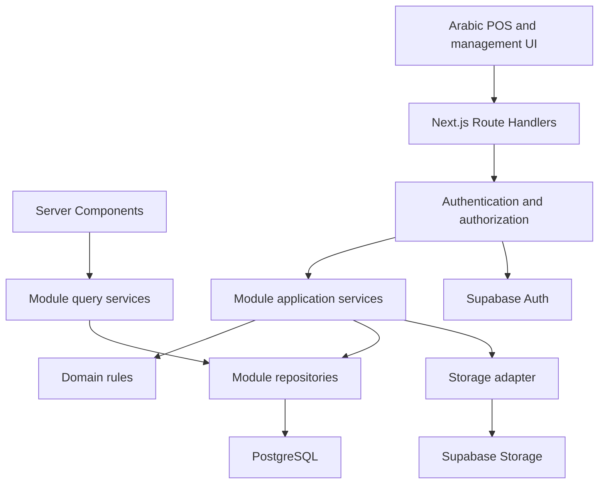

# Cashier POS Product Requirements and Architecture

**Document type:** Product requirements and technical architecture specification  
**Version:** 1.1  
**Status:** Draft for product alignment and implementation  
**Date:** 6 October 2026  
**Interface:** Arabic, RTL only  
**Architecture:** Modular monolith, one full-stack Next.js application  
**Initial hosting target:** Netlify Free and Supabase Free  
**Package manager:** pnpm

This specification extends the edited Cashier / POS Platform PRD version 1.0. It defines the sale lifecycle, module boundaries, technology decisions, logical database models, security controls, delivery phases, and acceptance criteria. The order remains the central commercial record; payments, invoices, receipts, returns, refunds, stock movements, and register sessions have independent identities and histories.

The product launches with one organization and one operating location. Organization and location boundaries are present from the first migration so additional locations can be introduced without redesigning historical sales. Multi-organization self-service onboarding is outside the MVP.

## 1. Product goals and scope

A cashier signs in, opens a register session, and immediately sees the product grid. Product search, barcode input, cart, optional customer, payment, and receipt actions remain part of one continuous workflow. Management functions are available through permission-aware navigation.

The platform must support walk-in sales, variants, discounts, exact totals, split payments, partial/full returns and refunds, inventory history, invoices, receipts, cash reconciliation, and reporting. Historical financial values must remain stable when catalog or tax settings change.

### Release boundaries

| Capability | MVP | Phase 1.5 | Phase 2 |
| --- | --- | --- | --- |
| Identity and authorization | Staff login, roles, permissions, organization/location access | Scoped approvals and stronger operational controls | Advanced permission policies |
| Catalog | Arabic products, variants, categories, images, SKU, barcode, favorites | Bulk tools and pricing extensions | Online catalog integrations |
| POS | Product grid, scanning, cart, optional customer, authorized discounts | Hold/resume orders and promotions | Mobile and offline-first POS |
| Sales | Orders, snapshots, timeline, cancellation controls | Fulfillment workflow when needed | Online channels |
| Payments | Cash, external terminal card recording, split payments | Optional integrated processor and partial payment policy | Gift cards and store credit |
| Documents | Arabic invoices and receipts, A4/80mm printing, browser Save as PDF | Server-generated PDF and delivery integrations if needed | Customer portal |
| Returns and refunds | Item returns, restock decision, controlled refunds | Broader approval workflows | Advanced policy automation |
| Inventory | Location stock, batches where needed, FEFO, movements, adjustments, expiration visibility | Transfers, supplier receipts, purchasing | Forecasting and purchasing suggestions |
| Registers | Open/close sessions, cash events, cash differences | Threshold approvals and operational refinements | Additional hardware integrations |
| Customers | Create, search, edit, history, basic statistics | Loyalty-ready extensions | Segmentation and loyalty |
| Reporting | Sales, payments, refunds, product, inventory, sessions, reconciliation | Supplier balances, advanced reports, daily aggregates | Advanced forecasting and AI reporting |
| Suppliers | Schema and module boundary only | Suppliers, purchases, receiving, payments, balances | Purchasing integrations |
| Organization/location | One configured organization/location; all records scoped | Multi-location operations | Multi-organization onboarding if requested |
| Connectivity | Network status, preserved cart, online checkout only | Cache improvements | Offline transaction synchronization |
| Notifications | In-app exceptions and low-stock/expiry views | Optional email/push adapters | SMS and automated integrations |

Purchase orders, transfers, integrated card payments, gift cards, store credit, autonomous AI actions, full accounting, payroll, manufacturing, and ERP functionality are outside the initial build. The wider edited PRD remains the long-term product model; future schemas described below do not make every feature an MVP obligation.

### Measurable acceptance targets

These are proposed engineering targets, to be measured on agreed cashier hardware with realistic seed data rather than treated as provider guarantees.

- A trained cashier completes a five-item cash sale in under 30 seconds, excluding product picking and customer conversation.
- Local add/remove/quantity interactions respond within 100 ms.
- Barcode lookup and interactive search complete within 700 ms at p95 under the agreed shop workload.
- Online cash checkout completes within 2 seconds at p95 under the agreed workload.
- An authorized manager finds an invoice by its number, order number, customer name, or phone in three interactions or fewer.
- Concurrent checkout never consumes the same available unit twice when negative stock is disabled.
- Repeated requests create one sale/payment/refund effect.
- A lost checkout response can be recovered by operation key.
- All issued documents and completed sales preserve original snapshots.
- Restore testing proves that database records and product images can be recovered.

## 2. Technology decisions

| Area | Selected technology | Purpose and rule |
| --- | --- | --- |
| Application | Next.js App Router, React, TypeScript strict mode | One application contains UI and backend; baseline Next.js 16/React 19 with patched compatible releases pinned at setup |
| Runtime | Node.js active LTS supported by the deployed Next.js/Netlify versions | Node runtime for business routes and PostgreSQL connections; validate exact version before initial install |
| Package management | pnpm | One committed pnpm-lock.yaml, exact packageManager version, frozen installation in CI |
| Repository | One repository and one app initially | Feature modules inside src; no Nx/Turbo until an actual second application/shared package needs them |
| CSS | Tailwind CSS | RTL-first logical spacing and sizing |
| Components | shadcn/ui with compatible Radix primitives | Arabic accessible dialogs, menus, tabs, tables; root RTL direction provider |
| Typography | Self-hosted Arabic font, such as Noto Sans Arabic | Font licensed for redistribution; reliable receipt printing without runtime font downloads |
| Icons | lucide-react | Consistent action icons; Arabic text labels for ambiguous controls |
| Forms | react-hook-form and zod | Field state and validation; repeat validation on the server |
| Server data | @tanstack/react-query | Search, infinite catalog, mutations, invalidation, background refresh |
| Cart and local workflows | React useReducer plus scoped Context | Reducer owns cart transitions; totals are derived; no Zustand required |
| Database | Supabase PostgreSQL | Relational transactions, constraints, locks, reporting |
| ORM | drizzle-orm | Typed server-side SQL and repositories |
| SQL driver | postgres | Small connection pool; Supabase transaction pooler with prepared statements disabled |
| Migrations | drizzle-kit plus reviewed SQL migrations | Database structure; hand-written constraints/RLS/functions where necessary |
| Identity | @supabase/supabase-js and @supabase/ssr | Supabase Auth and request-aware session integration |
| Product media | Supabase Storage | Object bytes outside PostgreSQL; database stores image metadata and paths |
| Hosting | Netlify Free | Full-stack Next.js deployment using the platform's supported runtime |
| HTTP contract | Next.js Route Handlers, Zod request/response schemas | /api/v1; one consistent transport for TanStack Query clients |
| Initial server rendering | Server Components calling query services | Avoid internal HTTP round trips; client cache hydration when appropriate |
| Charts | Recharts | Arabic management reports; tables provide exact values |
| Search | PostgreSQL indexes and pg_trgm where available | Exact barcode/SKU/number lookups; indexed normalized names; no Elasticsearch |
| Invoice/receipt rendering | React templates with print CSS | A4 and 80mm; window.print and browser Save as PDF in MVP |
| Decimal calculation | decimal.js | Exact intermediate arithmetic, followed by explicit currency rounding |
| Date display | Intl.DateTimeFormat | Store UTC instants; display location/organization timezone, initially Africa/Cairo |
| Unit/integration tests | Vitest | Domain calculations and PostgreSQL transaction behavior |
| UI tests | Testing Library | Forms, cart behavior, permissions and Arabic accessibility |
| End-to-end tests | Playwright | Sale, printing, returns, register lifecycle |
| Code quality | ESLint, TypeScript, Prettier | Explicit lint/typecheck commands, consistent formatting |
| Source and CI | GitHub and GitHub Actions | Pull-request checks; controlled production releases |
| Local services | Supabase CLI and Docker for local development | Local PostgreSQL/Auth/Storage; Docker is not a production hosting requirement |
| Logging | Structured JSON logs with request/operation IDs | Redacted logs, no secrets or full payment/customer payloads |
| Error monitoring | Optional Sentry | Separate quota/configuration decision; does not block the free MVP |
| Background work | PostgreSQL outbox plus bounded task endpoint | Same codebase; only enable asynchronous features with an authenticated reliable trigger |
| Realtime | Deferred Supabase Realtime | Useful later; not required for checkout correctness |
| Offline storage | Cart draft persistence initially; IndexedDB in Phase 2 | No offline financial completion in MVP |
| Integrated payments/email/SMS | Provider adapters, not enabled initially | Provider fees, signup and delivery requirements are separate from hosting |

Exact dependency versions must be recorded in package.json and the lockfile after compatibility testing. This specification names a baseline architecture; it does not claim that an unverified patch release is current or secure.

### Free hosting and no-card constraint

Netlify advertises a free signup without a credit card. Its current credit-based Free plan includes 300 monthly credits with a hard limit; projects pause when the monthly allowance is exhausted. This is a $0 starting environment within quotas, not guaranteed uninterrupted business hosting. Production deployments consume credits, so use local development and previews rather than deploying every change to production. [Netlify Free plan](https://www.netlify.com/blog/introducing-netlify-free-plan/) and [current credit-based plans](https://docs.netlify.com/manage/accounts-and-billing/billing/billing-for-credit-based-plans/credit-based-pricing-plans/).

Supabase Free currently includes 500 MB database storage and 1 GB file storage, and pauses inactive projects after one week. Automatic database backups are not included. Use the Free subscription without paid add-ons and confirm that the actual account onboarding can proceed without a payment method before committing to the provider. [Supabase pricing](https://supabase.com/pricing).

Use the included Netlify subdomain to avoid a domain purchase. Email delivery, SMS, card processing, fiscal integrations and managed PDF infrastructure are not automatically free. Do not enable paid services to satisfy the MVP.

Before accepting live shop dependency, measure traffic, build frequency, database/image growth and backup needs. If the allowance cannot support the shop workload, the operational requirement must change to a paid plan or another validated host; do not promise 100% free forever.

Netlify documents App Router and server-side Next.js support. Confirm the selected Next.js patch against its runtime in a deployed compatibility test. [Next.js on Netlify](https://docs.netlify.com/build/frameworks/framework-setup-guides/nextjs/overview/).

## 3. Modular monolith architecture

The application is one deployment unit. Each business module contains its own services, queries, repositories, validation, policies, and UI. PostgreSQL is one transactional database. Supabase Auth and Storage are managed infrastructure, not separate custom business microservices.



### Layer responsibilities

| Layer | Owns | Must not own |
| --- | --- | --- |
| UI | Interaction, form state, cart estimates, accessibility | Authoritative money, permission enforcement, direct SQL |
| Route Handler | Authentication, DTO validation, status codes, service invocation | Checkout orchestration or SQL-heavy business logic |
| Application service | Use-case orchestration, permission policy, transaction boundary | React rendering or framework-only dependencies |
| Domain rules | Calculations, allocations, eligibility, state transitions | HTTP requests or provider credentials |
| Query service | Authorized read models, filters, pagination, reporting | Financial mutations |
| Repository | Explicit SQL, locking, scoped persistence | HTTP responses or UI behavior |
| Infrastructure adapter | Auth, media, external terminal/provider integration | Replacing order semantics with provider-specific states |

Cross-module operations call exported service/query APIs. Checkout coordinates orders, inventory, payments, invoicing, registers, and audit inside one database transaction for locally recorded payments. Transaction-aware repositories receive the same Drizzle transaction object. Modules must not create nested independent transactions during that operation.

Avoid generic BaseRepository abstractions. Write named methods such as lockInventoryBalance, allocateBatches, createIssuedInvoice, and getRefundablePayment.

### Repository layout

```text
cashier-pos/
  src/
    app/
      layout.tsx
      (auth)/login/page.tsx
      (pos)/cashier/page.tsx
      (management)/
        orders/ invoices/ customers/ products/
        inventory/ registers/ staff/ reports/ settings/
        suppliers/ purchases/ transfers/
      api/v1/
        products/ customers/ orders/ checkout/
        payments/ refunds/ returns/ invoices/
        registers/ inventory/ reports/
        webhooks/ internal/
    modules/
      identity/ organization/ catalog/ pos/ customers/
      orders/ payments/ invoicing/ receipts/
      returns/ refunds/ inventory/ registers/
      discounts/ taxes/ suppliers/ purchasing/
      transfers/ reporting/ audit/ approvals/ notifications/
    shared/
      ui/ hooks/ errors/ money/ dates/ validation/
    server/
      db/ auth/ storage/ logging/ jobs/
  drizzle/
  public/fonts/
  tests/
    integration/
    e2e/
    fixtures/
  package.json
  pnpm-lock.yaml
  next.config.ts
  drizzle.config.ts
  tsconfig.json
  eslint.config.mjs
  netlify.toml
  .env.example
```

Folders for later-phase routes need not exist until implementation. Modules have public exports and enforced import boundaries.

```text
modules/orders/
  components/
  client/
    queries.ts
    mutations.ts
    query-keys.ts
  contracts/
    create-order.schema.ts
    order-response.schema.ts
  domain/
    order-state.ts
    totals.ts
  server/
    services/
    queries/
    repositories/
    policies/
  index.ts
```

Mark server modules server-only. Client barrels must never export database clients, secrets, or server repositories. Shared contracts expose DTOs rather than unrestricted database rows.

### Package manager and commands

Use pnpm exclusively in the repository. Pin the pnpm version in packageManager, commit the lockfile, and avoid mixing npm/yarn lockfiles. Choose a single installed app first; a pnpm workspace is introduced only when adding a real reusable package or second app.

| Command | Intended script behavior |
| --- | --- |
| pnpm install --frozen-lockfile | Reproduce approved dependencies |
| pnpm dev | Start Next.js development |
| pnpm build | Build production Next.js output |
| pnpm start | Run production output locally |
| pnpm lint | Run ESLint explicitly |
| pnpm typecheck | Run tsc --noEmit |
| pnpm test | Run Vitest |
| pnpm test:integration | Run PostgreSQL-backed integration suite |
| pnpm test:e2e | Run Playwright |
| pnpm db:generate | Generate migration files for review |
| pnpm db:migrate | Apply committed migrations with migration credentials |
| pnpm db:seed | Seed development fixtures; production seeding is explicit |
| pnpm format:check | Verify formatting |

## 4. Module responsibilities

| Module | Responsibilities and main models | Authorized operations | Boundary and completion rule |
| --- | --- | --- | --- |
| Identity | Staff profiles, memberships, roles, permissions, location assignments | Provision/disable staff, assign roles, authenticate | Auth proves identity; active memberships and permissions determine access |
| Organization | Organization, locations, policy settings, numbering | Configure business identity and locations | Every operational record is scoped; one location initially |
| Catalog | Categories, products, variants, images, favorites | Manage catalog, exact barcode lookup, browse/search | No edits to past sale snapshots; cost data requires separate permission |
| POS | Product grid, cart reducer, customer selection, checkout UI | Build cart, request server quote, checkout | Cart is provisional; only server results confirm a sale |
| Customers | Customer profile, tags, consent, history | Create/edit/search, view authorized history | Walk-in uses null customer_id; no fake customer shared across sales |
| Orders | Orders, lines, taxes, discounts, activity | Draft, quote, complete, cancel eligible order | Owns commercial snapshots and lifecycle; orchestrates checkout |
| Payments | Payment methods, attempts, payment records, reconciliation | Record cash/terminal payments; integrated processing later | Owns settlement history; does not delete or overwrite an order |
| Invoicing | Invoice records/items, credit notes, numbering | Issue, view, print, controlled correction | Issued values immutable; legal/fiscal integration is separately validated |
| Receipts | Payment acknowledgments and delivery log | Generate, print/reprint, download | Reprint records delivery; does not create a new sale |
| Returns | Return header/items, quantity and condition | Return items, decide restock | Returned quantity cannot exceed original unreturned quantity |
| Refunds | Refunds and refund allocations | Request/approve/process refund | Refund bounded by payment capacity; return and refund can be independent |
| Inventory | Balances, batches, allocations, movements, adjustment headers | Receive, allocate, adjust, inspect low stock/expiry | All quantity changes have movements; batches own expiration |
| Registers | Register, device sessions, shifts, cash events | Open/close, cash in/out, count drawer | Cash recording and sale confirmation commit together |
| Discounts | Manual policies, discounts and promotion definitions | Apply within limits, approve override | Server calculates and allocates discount; promotions later |
| Taxes | Categories, rates, line tax snapshots | Configure future rates | No silent tax changes to history |
| Approvals | Action-specific authorization records | Request/approve/reject | Approval binds exact action payload, scope and expiry |
| Audit | Immutable sensitive-action records | View/export authorized logs | Redacted before/after values, actor and correlation |
| Suppliers | Supplier profiles, product links, supplier ledger | Manage suppliers/payments/credits | Phase 1.5; balance derives from posted ledger entries |
| Purchasing | Purchase orders, items, goods receipts, supplier bills | Order, partially receive, post bill | Receiving changes stock; purchase order alone does not create a payable |
| Transfers | Transfer header/items, dispatch/receipt events | Dispatch/receive stock between locations | Phase 1.5; source, transit and destination are distinguishable |
| Reporting | Scoped SQL queries, reconciliation, daily metrics later | View operational or financial reports | Different definitions for sales, receipts, refunds and cashflow |
| Notifications | In-app notices and optional delivery jobs | Read/dismiss, configure channels | No paid delivery dependency for MVP |
| Background jobs | Outbox, idempotent dispatch, webhook inbox | Internal trusted execution | Durable state in PostgreSQL; no in-memory fire-and-forget tasks |

### Navigation and permissions

POS opens after login/register selection, rather than opening a chart dashboard. Cashiers see only permitted routes. Owner/Admin/Moderator/Cashier are default roles; permissions are authoritative.

Permissions include orders.create/view/cancel, payments.collect/reconcile, refunds.create/approve, returns.create, discounts.apply/override, products.manage/cost.view, inventory.view/adjust, invoices.issue/print, registers.open/close, cash.move, reports.view/financial, staff.manage, suppliers.manage, purchasing.manage, audit.view, and settings.manage.

Server authorization is mandatory even when navigation is hidden. Scope combines organization membership, location assignment, permission, account status, and action policy.

## 5. State and request contracts

Use React Hook Form for editable forms, TanStack Query for remote records, and a cart reducer for local POS state. A small boolean may use useState; reducers are used when transitions depend on related values.

Cart fields: items keyed by variant/custom line, quantities, selected customer, requested discount, notes, and draft operation key. Subtotal, tax estimate and total are derived rather than independently mutable state. Payment tender entry belongs in the checkout form.

Persist a cart draft without sensitive payment or customer details. A browser refresh may recover a draft; it must check the server for a pending/completed operation before issuing checkout again. Clear Query caches and local drafts appropriately when switching users or organizations.

### Transport rules

- Route Handlers expose /api/v1 with explicit request and response schemas.
- A checkout request contains variant IDs, quantities, optional customer ID, permitted discount instructions, payment allocations, and an idempotency key.
- Scope is resolved from authenticated membership and assigned register. Submitted organization/register/customer IDs are checked rather than trusted.
- Client prices, tax rates, cost and completed statuses are never authoritative.
- Response DTOs redact unit costs and restricted customer fields by permission.
- Errors include stable code, Arabic message, optional fieldErrors, and requestId.
- Pagination uses stable cursor tuples such as created_at/id, and search/filter values are included in query keys.
- State-changing requests use same-origin protections and authenticated cookies; external webhooks use their own signature verification.
- A server quote returns totals and a pricing/version reference. If authoritative prices change before checkout, return PRICE_CHANGED with new totals and require cashier confirmation rather than silently charging more.

| Operation | Endpoint example | Key rule |
| --- | --- | --- |
| Browse catalog | GET /api/v1/products?cursor=... | Filtered sellable variants, permission-safe fields |
| Barcode lookup | GET /api/v1/products/by-barcode?value=... | Exact normalized barcode |
| Customer search | GET /api/v1/customers?q=... | Scoped and bounded response |
| Quote | POST /api/v1/checkout/quote | No stock deduction or financial completion |
| Complete sale | POST /api/v1/checkout | Idempotent server transaction |
| Recover operation | GET /api/v1/operations/{key} | Same scope/actor policy; recover lost response |
| Return | POST /api/v1/orders/{id}/returns | Original quantities locked |
| Refund | POST /api/v1/orders/{id}/refunds | Remaining capacity locked |
| Issue invoice | POST /api/v1/orders/{id}/invoices | Unique issue key and immutable snapshot |
| Open/close drawer | POST /api/v1/registers/{id}/sessions | Only one open session |
| Adjustment | POST /api/v1/inventory/adjustments | Reason, authorized scope, movement history |

## 6. Data modeling conventions

The following are logical database models, not executable migrations. Each explicit field lists its PostgreSQL type and meaning. Required fields are non-null unless marked ?. Optional names do not imply duplicate sources of truth.

All business entities include **id uuid** primary key and **created_at timestamptz** server-generated UTC timestamp. Organization-scoped entities additionally include **organization_id uuid**. Mutable master records include **updated_at timestamptz** and **version integer default 1** for optimistic concurrency. Append-only ledgers/events do not include an editable version. Child snapshots inherit scope from their parent but retain organization_id for scoped indexing/RLS.

Foreign keys are named with _id. Use composite foreign keys containing organization_id where needed to prevent cross-organization references. Master records are archived/deactivated. Posted financial documents and ledger events cannot be hard-deleted through the application.

| Convention | Representation | Rule |
| --- | --- | --- |
| Money | bigint minor units | EGP initially uses 100 minor units per EGP; serialize bigint values as strings in JSON |
| Intermediate math | decimal.js, exact decimal strings | No binary floating-point totals; bounded rounding at documented stages |
| Currency | char(3), ISO code | Defaults to EGP; no cross-currency allocation or conversion in V1 |
| Quantity | numeric(18,3) | Permit fractional quantities only when variant configuration allows them |
| Rates | numeric(9,6) | Example 0.14 for 14%; document range and inclusive/exclusive behavior |
| Instant | timestamptz | UTC occurrence time; local display does not change the stored instant |
| Business date | date | Expiration/due/business dates, evaluated in location timezone |
| Status | text plus CHECK constraint | Explicit allowed values; migrations add new states |
| Structured snapshot | jsonb with a versioned schema | Seller/customer/approval payload; no arbitrary dumping of secrets |
| Phone | text | Normalized search form plus human display form |
| Human number | text | Unique inside the organization/document series |
| Hash | text | Canonical input/approval binding; do not store raw secrets |
| Notes | text | Internal/customer-visible fields kept distinct |

Currency rounding in V1: half-up to minor units after each line's discounted net/tax calculation; order totals equal the sum of stored line components. Whole-order discounts are allocated proportionally across eligible lines using largest remainder allocation in minor units. Refund allocations use the original line/tax/discount amounts and consume the remaining unrefunded allocation, so final full refund reconciles exactly.

Each group below inherits these common columns. Join tables may use a composite primary key instead of a separate id; this is stated per model.

## 7. Organization and staff models

### organizations

**Phase:** MVP. Business identity and default operating policy.

| Property | Type | Details |
| --- | --- | --- |
| name | text | Arabic display name |
| legal_name | text? | Seller legal name |
| tax_identifier | text? | Business tax reference |
| currency | char(3) | Default EGP |
| timezone | text | Default Africa/Cairo |
| phone, email | text? | Business contacts |
| address | jsonb | Structured business address |
| logo_path | text? | Supabase Storage path |
| status | text | ACTIVE / SUSPENDED / ARCHIVED |

**Rules:** Organization is seeded initially. Historical invoices snapshot seller data.

### organization_settings

**Phase:** MVP. Typed commercial policy configuration.

| Property | Type | Details |
| --- | --- | --- |
| organization_id | uuid unique | One settings row per organization |
| tax_price_mode | text | INCLUSIVE / EXCLUSIVE |
| allow_partial_payment | boolean | False initially unless enabled |
| allow_negative_stock | boolean | False by default |
| max_cashier_discount_rate | numeric(9,6) | Default policy limit |
| cashier_refund_limit_minor | bigint | Approval threshold |
| cash_difference_limit_minor | bigint | Closure approval threshold |
| return_window_days | integer? | Configured return policy |
| invoice_auto_issue | boolean | Issue on completion if enabled |
| receipt_footer | text? | Arabic printed footer |
| numbering_config | jsonb | Validated prefixes/year policy |
| rounding_policy | text | HALF_UP_LINE in V1 |

**Rules:** Settings changes are audited and do not alter historical snapshots.

### locations

**Phase:** MVP foundation; multiple in Phase 1.5. Store/warehouse scope.

| Property | Type | Details |
| --- | --- | --- |
| code | text | Unique per organization |
| name | text | Arabic name |
| type | text | STORE / WAREHOUSE |
| address | jsonb | Structured address |
| phone | text? | Contact |
| timezone | text | Effective location timezone |
| opening_hours | jsonb? | Validated weekly schedule |
| receipt_footer | text? | Location override |
| status | text | ACTIVE / INACTIVE / ARCHIVED |

**Rules:** Registers, balances, batches and orders reference their location.

### staff_profiles

**Phase:** MVP. Application identity associated with Supabase Auth.

| Property | Type | Details |
| --- | --- | --- |
| auth_user_id | uuid unique | References auth.users; profile is not a password table |
| display_name | text | Staff Arabic name |
| email, phone | text? | Contact display |
| status | text | ACTIVE / INACTIVE / SUSPENDED |
| last_active_at | timestamptz? | Operational activity |
| avatar_path | text? | Optional media |

**Rules:** Global profile has no organization_id. Organization access comes from membership. Staff passwords are managed by Auth.

### organization_memberships

**Phase:** MVP. Staff membership and organization-specific employee information.

| Property | Type | Details |
| --- | --- | --- |
| staff_profile_id | uuid | Staff identity |
| employee_code | text | Unique within organization |
| status | text | ACTIVE / INACTIVE / SUSPENDED |
| joined_at | timestamptz | Membership date |

**Rules:** Unique organization/staff pair. A disabled membership is rejected on every protected request.

### roles

**Phase:** MVP. Configurable permission group.

| Property | Type | Details |
| --- | --- | --- |
| key | text | Unique per organization: owner/admin/moderator/cashier defaults |
| name | text | Arabic role label |
| is_system | boolean | Protect required baseline roles |
| status | text | ACTIVE / INACTIVE |

**Rules:** Multiple roles per membership supported.

### permissions

**Phase:** MVP. Global capability catalog.

| Property | Type | Details |
| --- | --- | --- |
| key | text unique | Example refunds.approve |
| module | text | Business area |
| description | text | Human meaning |

**Rules:** Global model without organization_id; seeded code-owned keys.

### role_permissions

**Phase:** MVP. Role-to-capability association.

| Property | Type | Details |
| --- | --- | --- |
| role_id | uuid | Organization role |
| permission_id | uuid | Global permission |

**Rules:** Composite PK role_id/permission_id; role establishes organization scope.

### membership_roles

**Phase:** MVP. Membership role assignment.

| Property | Type | Details |
| --- | --- | --- |
| membership_id | uuid | Organization membership |
| role_id | uuid | Same organization role |
| assigned_by | uuid | Actor membership |

**Rules:** Composite PK membership_id/role_id, with same-organization constraint.

### staff_location_assignments

**Phase:** MVP. Allowed operating locations.

| Property | Type | Details |
| --- | --- | --- |
| membership_id | uuid | Assigned staff |
| location_id | uuid | Allowed location |
| is_default | boolean | Default location selection |

**Rules:** Unique membership/location. Management-wide access is an explicit policy, not inferred from client input.

### pos_credentials

**Phase:** Phase 1.5 unless fast switching is required. Optional PIN credentials for already authenticated register devices.

| Property | Type | Details |
| --- | --- | --- |
| membership_id | uuid unique | PIN owner |
| pin_hash | text | Adaptive password hash, never plaintext |
| failed_attempts | integer | Rate-limit tracking |
| locked_until | timestamptz? | Lockout |
| changed_at | timestamptz | Last change |

**Rules:** PIN alone cannot log in an unknown device. Implement only after validating secure hashing cost/runtime and brute-force controls.

## 8. Catalog and customer models

### categories

**Phase:** MVP. Product navigation and reporting grouping.

| Property | Type | Details |
| --- | --- | --- |
| parent_id | uuid? | Optional parent category |
| name | text | Arabic primary name |
| slug | text | Unique per organization |
| sort_order | integer | POS ordering |
| status | text | ACTIVE / INACTIVE / ARCHIVED |

**Rules:** Prevent category cycles. Orders preserve category snapshot for historical reports.

### products

**Phase:** MVP. Product-level catalog information.

| Property | Type | Details |
| --- | --- | --- |
| category_id | uuid? | Primary category |
| name | text | Arabic primary name |
| search_aliases | text[] | Optional Arabic/English search terms |
| description | text? | Arabic description |
| brand | text? | Optional brand |
| tax_category_id | uuid? | Default tax category |
| status | text | ACTIVE / INACTIVE / ARCHIVED |
| created_by | uuid | Actor membership |

**Rules:** Price, barcode, SKU and stock live on the sellable variant. Every simple product has one default variant.

### product_variants

**Phase:** MVP. Sellable unit and authoritative current price.

| Property | Type | Details |
| --- | --- | --- |
| product_id | uuid | Parent product |
| name | text | Default or option label |
| option_values | jsonb | Validated size/color/options |
| sku | text | Unique per organization |
| barcode | text? | Unique per organization when present |
| unit | text | piece/kg/litre or configured unit |
| allow_fractional_quantity | boolean | Whether decimal quantity is accepted |
| price_minor | bigint | Current selling price, nonnegative |
| cost_minor | bigint? | Current reference cost, permission-restricted |
| currency | char(3) | Organization currency |
| track_inventory | boolean | Service/non-stock variants can disable |
| track_expiration | boolean | Batch expiration required where enabled |
| tax_category_id | uuid? | Optional override |
| status | text | ACTIVE / INACTIVE / ARCHIVED |

**Rules:** Barcode stays text to preserve leading zeros. Enforce allowed quantity scale and nonnegative price/cost.

### product_images

**Phase:** MVP. Catalog media metadata.

| Property | Type | Details |
| --- | --- | --- |
| product_id | uuid | Parent product |
| variant_id | uuid? | Optional variant image |
| storage_path | text | Object key, no signed URL persistence |
| mime_type | text | Allowed image MIME |
| size_bytes | bigint | Upload limit accounting |
| width, height | integer | Rendered dimensions |
| alt_text | text? | Arabic accessibility description |
| sort_order | integer | Image order |
| is_primary | boolean | Primary thumbnail |

**Rules:** One effective primary image per product. Upload/replace authorized separately; no image bytes/base64 in product rows.

### product_favorites

**Phase:** MVP. Organization/location POS favorites.

| Property | Type | Details |
| --- | --- | --- |
| variant_id | uuid | Favorite sellable variant |
| location_id | uuid? | Null for organization-wide favorite |
| sort_order | integer | Display order |

**Rules:** Unique variant/location scope, using null-aware uniqueness for organization-wide favorites.

### customers

**Phase:** MVP. Optional known customer record.

| Property | Type | Details |
| --- | --- | --- |
| code | text | Unique organization customer code |
| first_name, last_name | text? | Optional split names |
| display_name | text | Required primary name |
| phone | text? | Display phone |
| phone_normalized | text? | Indexed normalized phone |
| email | text? | Validated optional email |
| company_name | text? | Business customer |
| tax_identifier | text? | Optional invoice identity |
| address | jsonb? | Structured address |
| internal_notes | text? | Restricted notes |
| marketing_consent | boolean | False by default |
| consent_updated_at | timestamptz? | Consent evidence timestamp |
| status | text | ACTIVE / ARCHIVED |

**Rules:** Phone duplicate policy is configurable; do not impose unique phone by default. Walk-in order customer_id is null.

### customer_tags

**Phase:** Phase 1.5. Reusable customer segmentation labels.

| Property | Type | Details |
| --- | --- | --- |
| name | text | Unique organization tag |
| color | text? | Validated presentation token |

**Rules:** Customer/tag join is unique customer_id/tag_id; no marketing automation in MVP.

### customer_tag_links

**Phase:** Phase 1.5. Customer tag membership.

| Property | Type | Details |
| --- | --- | --- |
| customer_id | uuid | Customer |
| tag_id | uuid | Tag |

**Rules:** Composite PK customer_id/tag_id, same organization. Statistics are calculated from completed commercial history, not manually edited fields.

## 9. Sales and tax models

### tax_categories

**Phase:** MVP. Tax classification.

| Property | Type | Details |
| --- | --- | --- |
| code | text | Unique organization category |
| name | text | Arabic label |
| status | text | ACTIVE / INACTIVE |

**Rules:** Examples STANDARD/ZERO/EXEMPT; these are labels, not a claim about applicable legal rates.

### tax_rates

**Phase:** MVP. Effective-dated configured tax rule.

| Property | Type | Details |
| --- | --- | --- |
| tax_category_id | uuid | Classification |
| location_id | uuid? | Optional local override |
| name | text | Printed tax label |
| rate | numeric(9,6) | Fraction, e.g. 0.14 |
| effective_from | timestamptz | Start instant |
| effective_to | timestamptz? | End instant |
| is_inclusive | boolean | Whether listed price includes tax |
| status | text | ACTIVE / INACTIVE |

**Rules:** Prevent overlapping effective rules for the same category/scope. V1 uses one rate per line; multi-component taxes require explicit future extension.

### orders

**Phase:** MVP. Central commercial record.

| Property | Type | Details |
| --- | --- | --- |
| number | text | Unique organization order number |
| location_id | uuid | Sale location |
| register_id | uuid? | Required for POS source |
| register_session_id | uuid? | Required for active POS cash operations |
| customer_id | uuid? | Null for walk-in |
| created_by | uuid | Staff membership |
| source | text | POS / WEB / MOBILE / MANUAL / API |
| status | text | DRAFT / OPEN / COMPLETED / CANCELLED |
| payment_status | text | UNPAID / PARTIALLY_PAID / PAID |
| fulfillment_status | text | NOT_REQUIRED / PENDING / PROCESSING / READY / FULFILLED |
| refund_status | text | NONE / PARTIAL / FULL |
| currency | char(3) | Sale currency |
| subtotal_minor | bigint | Sum of original line net values |
| discount_minor | bigint | Sum of allocated discounts |
| tax_minor | bigint | Sum of line taxes |
| total_minor | bigint | Discounted net plus tax |
| customer_snapshot | jsonb? | Customer details at completion |
| internal_notes | text? | Never printed by default |
| customer_notes | text? | Explicitly printable |
| completed_at, cancelled_at | timestamptz? | Lifecycle timestamps |
| cancelled_by | uuid? | Cancellation actor |
| cancellation_reason | text? | Required for cancellation |
| pricing_version | text? | Quote/confirmation reference |

**Rules:** Separate state axes replace the overloaded single status list in PRD 1.0. PAID/PROCESSING/REFUNDED are displayed badges derived from these axes. Paid orders are corrected with refunds/returns rather than cancellation.

### order_items

**Phase:** MVP. Immutable completed line snapshot.

| Property | Type | Details |
| --- | --- | --- |
| order_id | uuid | Parent order |
| variant_id | uuid? | Null for permitted custom item |
| line_type | text | PRODUCT / CUSTOM |
| product_name, variant_name | text | Arabic snapshot |
| sku_snapshot | text? | SKU at sale |
| category_id | uuid? | Historical category reference |
| category_name_snapshot | text? | Category label at sale |
| quantity | numeric(18,3) | Positive sale quantity |
| unit_price_minor | bigint | Original unit price |
| unit_cost_minor | bigint? | Authorized historical/allocated cost |
| subtotal_minor | bigint | Original net line amount |
| discount_minor | bigint | Allocated line discount |
| tax_minor | bigint | Line tax amount |
| total_minor | bigint | Final line amount |
| notes | text? | Line note |
| sort_order | integer | Document position |

**Rules:** A custom item does not create inventory movements. Actual batch allocations determine historical COGS for tracked stock; current catalog cost does not rewrite it.

### order_item_taxes

**Phase:** MVP. Applied tax snapshot per line.

| Property | Type | Details |
| --- | --- | --- |
| order_item_id | uuid | Sale line |
| tax_rate_id | uuid? | Source configured rule |
| name | text | Printed tax label |
| rate | numeric(9,6) | Applied fraction |
| is_inclusive | boolean | Applied mode |
| taxable_minor | bigint | Discounted tax base |
| tax_minor | bigint | Rounded tax amount |

**Rules:** Amounts sum to the line tax. Configured rule changes do not update this row.

### order_discounts

**Phase:** MVP. Discount instructions and applied results.

| Property | Type | Details |
| --- | --- | --- |
| order_id | uuid | Parent order |
| order_item_id | uuid? | Null for whole order |
| type | text | FIXED / PERCENTAGE |
| requested_value | numeric(18,6) | Percent fraction or fixed minor-unit value |
| applied_minor | bigint | Server-authorized allocated amount |
| reason | text? | Required for override |
| promotion_id | uuid? | Future promotion source |
| applied_by | uuid | Actor |
| approval_id | uuid? | Bound override approval |

**Rules:** Allocation never makes an eligible line negative. Do not apply a whole-order discount twice.

### order_events

**Phase:** MVP. Operational timeline.

| Property | Type | Details |
| --- | --- | --- |
| order_id | uuid | Order |
| event_type | text | OrderCreated/PaymentSucceeded/etc. |
| actor_id | uuid? | Membership; null for trusted automated event |
| occurred_at | timestamptz | Actual event time |
| payload | jsonb | Safe structured details |
| correlation_id | text | Operation correlation |

**Rules:** Append-only, separate from security audit events.

### document_sequences

**Phase:** MVP. Concurrency-safe number allocation.

| Property | Type | Details |
| --- | --- | --- |
| document_type | text | ORDER / INVOICE / RECEIPT / RETURN / CREDIT_NOTE / PURCHASE |
| series | text | Prefix/location/year configuration |
| period | text | Example 2026 |
| next_value | bigint | Next sequence value |

**Rules:** Unique organization/type/series/period. Lock allocator row in the document transaction. Numbering policy must be validated separately for fiscal use; do not promise gap-free numbering.

### promotions

**Phase:** Phase 1.5. Bounded future automatic promotions.

| Property | Type | Details |
| --- | --- | --- |
| code | text? | Optional coupon |
| name | text | Arabic label |
| type | text | PERCENT / FIXED / BUY_X_GET_Y |
| rules | jsonb | Versioned eligible products/time/threshold schema |
| starts_at, ends_at | timestamptz? | Validity |
| usage_limit | integer? | Usage cap |
| status | text | DRAFT / ACTIVE / ENDED / DISABLED |

**Rules:** Promotion interpretation is deterministic; redemption rows are locked when enforcing limits.

## 10. Payment and document models

### payment_methods

**Phase:** MVP. Organization-enabled settlement methods.

| Property | Type | Details |
| --- | --- | --- |
| code | text | CASH / CARD / BANK_TRANSFER / OTHER; STORE_CREDIT/GIFT_CARD later |
| name | text | Arabic display label |
| mode | text | MANUAL / INTEGRATED |
| enabled | boolean | Available at checkout |
| requires_reference | boolean | Terminal/transfer evidence policy |

**Rules:** Cash and manually recorded external-terminal card payments initially. Bank transfer is confirmed only by an authorized verification workflow.

### payments

**Phase:** MVP. Payment event against an order.

| Property | Type | Details |
| --- | --- | --- |
| order_id | uuid | Parent order |
| payment_method_id | uuid | Enabled method |
| register_session_id | uuid? | Cash movement context |
| amount_minor | bigint | Amount actually allocated to the order |
| currency | char(3) | Must match order |
| status | text | PENDING / PROCESSING / SUCCEEDED / FAILED / CANCELLED |
| refund_status | text | NONE / PARTIAL / FULL |
| tendered_minor | bigint? | Cash received |
| change_minor | bigint? | Tendered minus allocated cash |
| provider | text? | External terminal/provider |
| provider_reference | text? | Transaction reference |
| card_brand, card_last4 | text? | Permitted masked details only |
| recorded_by | uuid? | Actor |
| succeeded_at | timestamptz? | Confirmation time |
| failure_code | text? | Safe failure classification |
| idempotency_key | text | Unique scoped business operation key |

**Rules:** Cash drawer inflow uses amount_minor, not tendered_minor. Unique provider reference where reliable. Original successful payment amount remains immutable; refund events are separate.

### payment_attempts

**Phase:** Integrated payments phase. Recoverable provider interaction.

| Property | Type | Details |
| --- | --- | --- |
| payment_id | uuid | Logical payment |
| provider_request_key | text | Stable provider idempotency key |
| attempt_number | integer | Retry history |
| status | text | CREATED / SENT / CONFIRMED / FAILED / UNKNOWN |
| provider_reference | text? | Processor reference |
| started_at, finished_at | timestamptz? | Execution times |
| error_code | text? | Redacted diagnostic |

**Rules:** UNKNOWN requires provider reconciliation, not a fresh charge. No provider call occurs while holding stock/payment database locks.

### invoices

**Phase:** MVP. Issued commercial snapshot.

| Property | Type | Details |
| --- | --- | --- |
| order_id | uuid | Sale reference |
| number | text | Unique organization invoice number |
| issue_status | text | DRAFT / ISSUED / VOID |
| settlement_status | text | UNPAID / PARTIALLY_PAID / PAID |
| issued_at | timestamptz? | Issue instant |
| issued_by | uuid? | Actor |
| currency | char(3) | Snapshot currency |
| seller_snapshot | jsonb | Legal/name/address/tax data |
| customer_snapshot | jsonb? | Optional buyer data |
| subtotal_minor, discount_minor, tax_minor, total_minor | bigint | Exact snapshot totals |
| template_version | text | Reproducible print rendering |
| void_reason | text? | Controlled void reason |
| fiscal_reference | text? | Future tax authority reference |

**Rules:** V1 has at most one primary invoice per order, enforced by unique order_id. Payment settlement can change through allocations; issued line values cannot. Tax-authority certification is outside ordinary HTML invoice generation.

### invoice_items

**Phase:** MVP. Invoice line snapshots.

| Property | Type | Details |
| --- | --- | --- |
| invoice_id | uuid | Parent invoice |
| order_item_id | uuid? | Original commercial line |
| description | text | Arabic line label |
| sku_snapshot | text? | Optional SKU |
| quantity | numeric(18,3) | Issued quantity |
| unit_price_minor | bigint | Issued price |
| discount_minor, taxable_minor, tax_minor, total_minor | bigint | Line amounts |
| tax_snapshot | jsonb | Rate/name/inclusive information |
| sort_order | integer | Print order |

**Rules:** Items are copied at issuance, not resolved from current products.

### receipts

**Phase:** MVP. Payment acknowledgment with reproducible rendering.

| Property | Type | Details |
| --- | --- | --- |
| order_id | uuid | Commercial source |
| number | text | Unique organization receipt number |
| register_session_id | uuid? | Cash session |
| issued_by | uuid? | Actor |
| issued_at | timestamptz | Receipt time |
| currency | char(3) | Receipt currency |
| paid_minor | bigint | Payments acknowledged in this receipt |
| change_minor | bigint | Cash change shown |
| remaining_due_minor | bigint | Balance at receipt time |
| snapshot | jsonb | Seller/location/lines/totals/customer/template data |

**Rules:** One order may have several receipts for different payment events. One reprint does not create a new receipt number.

### receipt_payments

**Phase:** MVP. Payments covered by a receipt.

| Property | Type | Details |
| --- | --- | --- |
| receipt_id | uuid | Receipt |
| payment_id | uuid | Acknowledged payment |
| amount_minor | bigint | Acknowledged allocation |

**Rules:** Unique receipt/payment pair. Ensure one payment allocation is not unintentionally acknowledged in duplicate original receipts.

### document_deliveries

**Phase:** MVP print log; integrations later. Print/reprint/download/email delivery evidence.

| Property | Type | Details |
| --- | --- | --- |
| document_type | text | INVOICE / RECEIPT / CREDIT_NOTE |
| document_id | uuid | Authorized document reference |
| channel | text | PRINT / PDF / EMAIL / SMS |
| requested_by | uuid | Actor |
| status | text | REQUESTED / RENDERED / SENT / FAILED |
| recipient_masked | text? | Redacted recipient |
| completed_at | timestamptz? | Result time |
| error_code | text? | Safe diagnostic |

**Rules:** Browser print initiation cannot prove that paper physically printed. Use RENDERED rather than inventing delivery success.

### credit_notes

**Phase:** MVP controlled correction foundation. Commercial invoice correction linked to a refund/return where appropriate.

| Property | Type | Details |
| --- | --- | --- |
| invoice_id | uuid | Original issued invoice |
| refund_id | uuid? | Optional related money refund |
| return_id | uuid? | Optional related item return |
| number | text | Unique credit-note number |
| status | text | DRAFT / ISSUED / VOID |
| reason | text | Correction reason |
| currency | char(3) | Original invoice currency |
| net_minor, tax_minor, total_minor | bigint | Positive credited components |
| issued_by | uuid? | Actor |
| issued_at | timestamptz? | Issue time |
| seller_snapshot, customer_snapshot | jsonb | Historical parties |

**Rules:** Credit note adjusts the commercial document; it does not itself transfer money. Local fiscal behavior requires separate validation.

### credit_note_items

**Phase:** MVP foundation. Credit quantities and values against original lines.

| Property | Type | Details |
| --- | --- | --- |
| credit_note_id | uuid | Parent credit note |
| invoice_item_id | uuid? | Original line |
| description | text | Correction label |
| quantity | numeric(18,3) | Credited quantity |
| net_minor, tax_minor, total_minor | bigint | Original-allocation-based credit |
| tax_snapshot | jsonb | Original tax details |

**Rules:** Cumulative credited quantities/amounts are bounded by eligible invoice values.

## 11. Return and refund models

### returns

**Phase:** MVP. Physical goods return transaction.

| Property | Type | Details |
| --- | --- | --- |
| order_id | uuid | Original sale |
| number | text | Unique organization return number |
| location_id | uuid | Receiving location |
| status | text | DRAFT / CONFIRMED / CANCELLED |
| reason | text | General return reason |
| processed_by | uuid | Actor |
| approval_id | uuid? | Required policy approval |
| confirmed_at | timestamptz? | Physical acceptance time |
| notes | text? | Restricted notes |

**Rules:** A return may be confirmed before its money refund succeeds. Cancellation cannot erase already-posted stock movements.

### return_items

**Phase:** MVP. Returned line quantity, condition and stock treatment.

| Property | Type | Details |
| --- | --- | --- |
| return_id | uuid | Parent return |
| order_item_id | uuid | Original sold line |
| quantity | numeric(18,3) | Positive returned quantity |
| reason | text | Item reason |
| condition | text | SELLABLE / DAMAGED / DEFECTIVE / OTHER |
| restock_action | text | SELLABLE / QUARANTINE / WRITE_OFF / NO_STOCK |
| original_batch_id | uuid? | If identified |
| destination_batch_id | uuid? | New/restocked batch where known |
| net_minor, tax_minor, total_minor | bigint | Original commercial allocation |
| inspection_notes | text? | Condition evidence |

**Rules:** Sellable return with unknown lot/expiry enters quarantine until inspected. Damaged/expired items never increase sellable available quantity.

### refunds

**Phase:** MVP. Money refund operation against one original payment.

| Property | Type | Details |
| --- | --- | --- |
| order_id | uuid | Original order |
| payment_id | uuid | Original successful payment |
| return_id | uuid? | Related return |
| register_session_id | uuid? | Cash refund session |
| amount_minor | bigint | Positive requested/refunded amount |
| currency | char(3) | Original currency |
| status | text | REQUESTED / APPROVED / PROCESSING / SUCCEEDED / FAILED / CANCELLED / UNKNOWN |
| reason | text | Required explanation |
| requested_by | uuid | Actor |
| approval_id | uuid? | Bound approval |
| provider_reference | text? | External refund reference |
| idempotency_key | text | Unique operation key |
| succeeded_at | timestamptz? | Actual result time |
| failure_code | text? | Safe diagnostic |

**Rules:** Split-payment refund can create several refund rows under one operation group. Lock payment and reserve pending amounts before provider dispatch; release only on definitive failure/cancellation.

### refund_items

**Phase:** MVP. Refund monetary allocation to original sale items.

| Property | Type | Details |
| --- | --- | --- |
| refund_id | uuid | Parent refund |
| order_item_id | uuid | Original sale line |
| return_item_id | uuid? | Related physical return line |
| quantity | numeric(18,3)? | Quantity when line-based |
| net_minor, tax_minor, total_minor | bigint | Original allocation consumed |
| reason | text? | Non-return adjustment reason |

**Rules:** Refund without a physical return is allowed only under explicit policy. Never exceed the remaining original line or payment allocation.

## 12. Inventory models

### inventory_balances

**Phase:** MVP. Current per-location sellable stock summary.

| Property | Type | Details |
| --- | --- | --- |
| location_id | uuid | Stock location |
| variant_id | uuid | Sellable variant |
| on_hand_quantity | numeric(18,3) | Sellable stock currently owned at location |
| reserved_quantity | numeric(18,3) | Held for pending integrated/fulfillment operations |
| low_stock_threshold | numeric(18,3) | Threshold |
| version | integer | Concurrent update control |

**Rules:** Unique organization/location/variant. Available = on_hand - reserved. Batches/ledger remain explainable sources; service-maintained summary updates inside movement transactions.

### inventory_batches

**Phase:** MVP for batch/expiry goods. Lot, expiration and cost tracking.

| Property | Type | Details |
| --- | --- | --- |
| location_id | uuid | Current location |
| variant_id | uuid | Tracked variant |
| lot_code | text | Internal/supplier lot identifier |
| supplier_id | uuid? | Future supplier link |
| goods_receipt_item_id | uuid? | Purchase source |
| received_at | timestamptz | Receipt time |
| expires_on | date? | Location-local expiration date |
| expiration_policy | text | BLOCK_ON_DATE / SELL_THROUGH_DATE |
| received_quantity | numeric(18,3) | Original quantity |
| remaining_quantity | numeric(18,3) | Current batch quantity |
| reserved_quantity | numeric(18,3) | Held quantity |
| unit_cost_minor | bigint? | Batch cost |
| currency | char(3) | Cost currency |
| stock_state | text | SELLABLE / QUARANTINED / DAMAGED / EXPIRED |
| origin_batch_id | uuid? | Transfer/return traceability |

**Rules:** Expiration is on batch, not product. Non-expiring tracked stock uses batches with null expiration. Batch disposition changes must be ledgered, not a silent status toggle.

### inventory_movements

**Phase:** MVP. Append-only physical stock ledger.

| Property | Type | Details |
| --- | --- | --- |
| location_id | uuid | Movement location |
| variant_id | uuid | Moved variant |
| batch_id | uuid? | Tracked lot |
| quantity_delta | numeric(18,3) | Signed quantity change |
| movement_type | text | INITIAL / SALE / RETURN / PURCHASE_RECEIPT / TRANSFER_IN / TRANSFER_OUT / ADJUSTMENT / DAMAGE / LOSS / EXPIRY / RECLASSIFY |
| stock_state | text | Which sellable/quarantine/damaged bucket changed |
| unit_cost_minor | bigint? | Historical valuation |
| order_item_id, return_item_id | uuid? | Sale/return references |
| goods_receipt_item_id, transfer_item_id, adjustment_id | uuid? | Other source references |
| performed_by | uuid? | Actor |
| reason | text? | Mandatory for manual movement |
| occurred_at | timestamptz | Movement instant |
| operation_line_key | text | Unique deduplication key |

**Rules:** Ensure exactly one valid source family per movement. Reclassification has paired out/in movements. No direct balance writes outside inventory services.

### inventory_allocations

**Phase:** MVP. Which batch supplied each sale line.

| Property | Type | Details |
| --- | --- | --- |
| order_item_id | uuid | Sold line |
| batch_id | uuid | Consumed batch |
| quantity | numeric(18,3) | Allocated quantity |
| unit_cost_minor | bigint? | Historical batch cost |
| movement_id | uuid | Related sale movement |

**Rules:** Supports FEFO consumption, return traceability and product profitability. Sum of allocations equals tracked sold quantity.

### inventory_reservations

**Phase:** Integrated payments/fulfillment phase. Durable stock hold before final completion.

| Property | Type | Details |
| --- | --- | --- |
| order_item_id | uuid | Pending line |
| batch_id | uuid | Reserved lot |
| quantity | numeric(18,3) | Held quantity |
| status | text | ACTIVE / CONSUMED / RELEASED / EXPIRED |
| expires_at | timestamptz | Hold expiry |
| consumed_at, released_at | timestamptz? | Resolution |

**Rules:** Reservation expiry must account for UNKNOWN payment states; reconcile first so successful payment is not left without fulfillment.

### inventory_adjustments

**Phase:** MVP. Authorized adjustment request/header.

| Property | Type | Details |
| --- | --- | --- |
| location_id | uuid | Affected location |
| variant_id | uuid | Affected variant |
| batch_id | uuid? | Affected lot |
| previous_quantity | numeric(18,3) | Locked quantity before change |
| quantity_delta | numeric(18,3) | Adjustment |
| new_quantity | numeric(18,3) | Result |
| reason | text | Required |
| notes | text? | Explanation |
| requested_by | uuid | Actor |
| approval_id | uuid? | Threshold approval |
| status | text | DRAFT / POSTED / CANCELLED |
| posted_at | timestamptz? | Effect time |

**Rules:** A posted adjustment creates ledger movements exactly once. History is not edited.

### stock_transfers

**Phase:** Phase 1.5. Inter-location transfer.

| Property | Type | Details |
| --- | --- | --- |
| number | text | Unique transfer number |
| source_location_id | uuid | Dispatch location |
| destination_location_id | uuid | Receiving location |
| status | text | DRAFT / REQUESTED / APPROVED / IN_TRANSIT / PARTIALLY_RECEIVED / RECEIVED / CANCELLED |
| requested_by | uuid | Actor |
| approval_id | uuid? | Policy approval |
| dispatched_at, received_at | timestamptz? | Event times |
| notes | text? | Handling details |

**Rules:** Source and destination differ. Dispatched transfers cannot simply cancel; reversal/return movements are required.

### stock_transfer_items

**Phase:** Phase 1.5. Requested/dispatched/received transfer quantities.

| Property | Type | Details |
| --- | --- | --- |
| transfer_id | uuid | Header |
| variant_id | uuid | Item |
| source_batch_id | uuid | Original lot |
| requested_quantity | numeric(18,3) | Requested amount |
| dispatched_quantity | numeric(18,3) | Shipped amount |
| received_quantity | numeric(18,3) | Cumulative received amount |
| damaged_quantity | numeric(18,3) | Recorded transit/receipt loss |
| unit_cost_minor | bigint? | Original cost |

**Rules:** Partial receipt needs stock_transfer_receipts and items, defined below, rather than overwriting only counters.

### stock_transfer_receipts

**Phase:** Phase 1.5. Each receiving event.

| Property | Type | Details |
| --- | --- | --- |
| transfer_id | uuid | Transfer |
| received_by | uuid | Actor |
| received_at | timestamptz | Receipt instant |
| idempotency_key | text | Duplicate protection |
| notes | text? | Discrepancy notes |

**Rules:** Posted receipt is append-only.

### stock_transfer_receipt_items

**Phase:** Phase 1.5. Batch-specific transfer receipt.

| Property | Type | Details |
| --- | --- | --- |
| transfer_receipt_id | uuid | Receiving event |
| transfer_item_id | uuid | Original item |
| destination_batch_id | uuid | Lot at receiving location |
| received_quantity | numeric(18,3) | Accepted quantity |
| damaged_quantity | numeric(18,3) | Damaged portion |
| movement_id | uuid | Destination movement |

**Rules:** Preserve source batch expiry/cost and cumulative bounds. Transit stock is reported separately.

## 13. Register and cash models

### registers

**Phase:** MVP. Physical checkout station.

| Property | Type | Details |
| --- | --- | --- |
| location_id | uuid | Location |
| code | text | Unique location register code |
| name | text | Arabic label |
| status | text | ACTIVE / INACTIVE |
| receipt_width_mm | integer | 80 initially; A4 is separate template |
| last_seen_at | timestamptz? | Operational health |

**Rules:** A register cannot be changed to another location while an open session exists.

### register_device_sessions

**Phase:** Phase 1.5 for fast PIN switching. Authenticated register device context.

| Property | Type | Details |
| --- | --- | --- |
| register_id | uuid | Device register |
| device_identifier_hash | text | Bound device reference |
| authenticated_by | uuid | Staff identity |
| token_hash | text | Hashed device token |
| expires_at | timestamptz | Expiry |
| revoked_at | timestamptz? | Revocation |

**Rules:** Do not store raw persistent tokens. MVP uses normal staff login.

### register_sessions

**Phase:** MVP. Cash drawer operating period.

| Property | Type | Details |
| --- | --- | --- |
| register_id | uuid | Drawer |
| opened_by | uuid | Actor |
| opened_at | timestamptz | Opening |
| status | text | OPEN / CLOSING / CLOSED |
| currency | char(3) | Drawer currency |
| opening_cash_minor | bigint | Counted opening float |
| expected_cash_minor | bigint? | Frozen closing expectation |
| counted_cash_minor | bigint? | Physical closing count |
| difference_minor | bigint? | Counted minus expected |
| closed_by | uuid? | Closing actor |
| closed_at | timestamptz? | Closure |
| closing_notes | text? | Required discrepancy explanation |
| approval_id | uuid? | Threshold approval |

**Rules:** Partial unique index enforces one non-closed session per register. Closing locks session; checkout/cash movement verifies OPEN using same locking discipline.

### cash_events

**Phase:** MVP. Append-only actual drawer activity.

| Property | Type | Details |
| --- | --- | --- |
| register_session_id | uuid | Drawer session |
| type | text | OPENING / SALE / REFUND / CASH_IN / CASH_OUT / PAID_OUT |
| amount_delta_minor | bigint | Signed drawer change |
| payment_id | uuid? | Cash sale source |
| refund_id | uuid? | Cash refund source |
| reason | text? | Mandatory for manual events |
| performed_by | uuid | Actor |
| approval_id | uuid? | Required authorization |
| occurred_at | timestamptz | Cash time |
| operation_key | text | Unique financial effect |

**Rules:** Expected cash is sum of ledger deltas including one OPENING event. Do not add opening_cash_minor again. Closing count/difference is a session snapshot, not an additional cash delta.

## 14. Suppliers and purchasing models

### suppliers

**Phase:** Phase 1.5. Supplier master.

| Property | Type | Details |
| --- | --- | --- |
| code | text | Unique organization code |
| name | text | Supplier name |
| contact_person | text? | Contact |
| phone, email | text? | Contact channels |
| address | jsonb? | Postal details |
| tax_identifier | text? | Tax identity |
| payment_terms_days | integer? | Default due policy |
| notes | text? | Operational notes |
| status | text | ACTIVE / INACTIVE / ARCHIVED |

**Rules:** Outstanding balance is derived from supplier ledger, not an editable supplier.balance field.

### supplier_products

**Phase:** Phase 1.5. Supplier sourcing relationship.

| Property | Type | Details |
| --- | --- | --- |
| supplier_id | uuid | Supplier |
| variant_id | uuid | Catalog unit |
| supplier_sku | text? | Vendor code |
| last_unit_cost_minor | bigint? | Reference cost |
| currency | char(3) | Cost currency |
| lead_time_days | integer? | Expected fulfillment |
| minimum_order_quantity | numeric(18,3)? | Ordering rule |

**Rules:** Unique supplier/variant. Does not modify old purchase costs.

### purchase_orders

**Phase:** Phase 1.5. Intent to buy stock.

| Property | Type | Details |
| --- | --- | --- |
| supplier_id | uuid | Vendor |
| location_id | uuid | Receiving destination |
| number | text | Unique purchase number |
| status | text | DRAFT / SUBMITTED / CONFIRMED / PARTIALLY_RECEIVED / RECEIVED / CANCELLED |
| currency | char(3) | Purchase currency |
| subtotal_minor, tax_minor, total_minor | bigint | Expected totals |
| expected_delivery_on | date? | Expected date |
| created_by | uuid | Actor |
| notes | text? | Purchase notes |

**Rules:** Purchase order does not itself establish supplier debt. Vendor bill/posted payable does.

### purchase_order_items

**Phase:** Phase 1.5. Ordered unit and cost snapshot.

| Property | Type | Details |
| --- | --- | --- |
| purchase_order_id | uuid | Parent |
| variant_id | uuid | Stock unit |
| description | text | Vendor/product snapshot |
| ordered_quantity | numeric(18,3) | Requested quantity |
| received_quantity | numeric(18,3) | Transaction-maintained summary |
| unit_cost_minor | bigint | Expected unit cost |
| tax_rate | numeric(9,6) | Applied expected rate |
| net_minor, tax_minor, total_minor | bigint | Expected values |

**Rules:** Partial receipts have separate immutable events.

### goods_receipts

**Phase:** Phase 1.5. Each accepted delivery.

| Property | Type | Details |
| --- | --- | --- |
| purchase_order_id | uuid? | Optional purchase source |
| supplier_id | uuid | Vendor |
| location_id | uuid | Destination |
| number | text | Unique receipt code |
| status | text | DRAFT / POSTED / CANCELLED |
| received_at | timestamptz | Delivery time |
| received_by | uuid | Actor |
| idempotency_key | text | Duplicate protection |
| notes | text? | Discrepancies |

**Rules:** Post header/items/batches/movements in one transaction. Posted receipts are corrected with reversals.

### goods_receipt_items

**Phase:** Phase 1.5. Received quantities, cost, lot and expiry.

| Property | Type | Details |
| --- | --- | --- |
| goods_receipt_id | uuid | Delivery header |
| purchase_order_item_id | uuid? | Ordered line |
| variant_id | uuid | Received unit |
| quantity | numeric(18,3) | Accepted quantity |
| lot_code | text | Lot |
| expires_on | date? | Expiry |
| stock_state | text | SELLABLE / QUARANTINED |
| unit_cost_minor | bigint | Accepted unit cost |
| batch_id | uuid | Created stock lot |

**Rules:** Enforce cumulative receipt limits or require explicit over-receiving approval.

### supplier_bills

**Phase:** Phase 1.5. Actual supplier payable document.

| Property | Type | Details |
| --- | --- | --- |
| supplier_id | uuid | Vendor |
| purchase_order_id | uuid? | Related purchase |
| vendor_invoice_number | text | Vendor document reference |
| issued_on, due_on | date | Issue/due date |
| currency | char(3) | Payable currency |
| net_minor, tax_minor, total_minor | bigint | Invoice values |
| status | text | DRAFT / POSTED / VOID |
| posted_by | uuid? | Actor |
| posted_at | timestamptz? | Posting instant |

**Rules:** Unique supplier/vendor invoice reference. Add bill items below rather than treating order estimates as payable.

### supplier_bill_items

**Phase:** Phase 1.5. Supplier billed units and tax.

| Property | Type | Details |
| --- | --- | --- |
| supplier_bill_id | uuid | Payable |
| goods_receipt_item_id | uuid? | Received source |
| variant_id | uuid? | Product, null for service charge |
| description | text | Vendor line |
| quantity | numeric(18,3) | Billed amount |
| unit_cost_minor | bigint | Billed price |
| net_minor, tax_minor, total_minor | bigint | Billed values |
| tax_snapshot | jsonb | Tax detail |

**Rules:** Bill/receipt price differences are explicit reconciliation items.

### supplier_payments

**Phase:** Phase 1.5. Vendor settlement.

| Property | Type | Details |
| --- | --- | --- |
| supplier_id | uuid | Vendor |
| amount_minor | bigint | Positive payment |
| currency | char(3) | Supplier ledger currency |
| method | text | CASH / BANK_TRANSFER / OTHER |
| reference | text? | Evidence |
| paid_at | timestamptz | Actual time |
| paid_by | uuid | Actor |
| status | text | DRAFT / POSTED / REVERSED |
| idempotency_key | text | Duplicate protection |

**Rules:** Payment allocations connect to bills; unapplied vendor credit is visible.

### supplier_payment_allocations

**Phase:** Phase 1.5. Vendor payment applied to bills.

| Property | Type | Details |
| --- | --- | --- |
| supplier_payment_id | uuid | Settlement |
| supplier_bill_id | uuid | Payable |
| amount_minor | bigint | Applied amount |

**Rules:** Unique payment/bill pair. Lock bill balances; never over-allocate payment or payable.

### supplier_ledger_entries

**Phase:** Phase 1.5. Explainable supplier balance movements.

| Property | Type | Details |
| --- | --- | --- |
| supplier_id | uuid | Vendor |
| entry_type | text | BILL / PAYMENT / CREDIT / REVERSAL |
| amount_delta_minor | bigint | Positive owed; negative reduces owed |
| currency | char(3) | Balance currency |
| supplier_bill_id | uuid? | Bill source |
| supplier_payment_id | uuid? | Payment source |
| reverses_entry_id | uuid? | Correction source |
| reason | text? | Credit/reversal explanation |
| posted_at | timestamptz | Ledger time |
| operation_key | text | Unique posted effect |

**Rules:** Balance equals sum of posted deltas by supplier/currency. Future vendor credit-note documents can extend this ledger.

## 15. Control, audit and background models

### approval_requests

**Phase:** MVP for required thresholds. Exact-action manager authorization.

| Property | Type | Details |
| --- | --- | --- |
| action_type | text | Refund/discount/adjustment/closure |
| target_type | text | Typed resource |
| target_id | uuid | Affected record |
| requested_by | uuid | Requester |
| approved_by | uuid? | Approver |
| payload_hash | text | Canonical exact action/version binding |
| payload | jsonb | Redacted requested amounts/scope/reason |
| status | text | PENDING / APPROVED / REJECTED / EXPIRED / CONSUMED |
| expires_at | timestamptz | Validity |
| approved_at, consumed_at | timestamptz? | Authorization/use |
| reason | text | Justification |

**Rules:** Approver permission rechecked; one approval consumed once. Changing amount/item/version invalidates the grant. Separation-of-duties policy controls self-approval.

### audit_logs

**Phase:** MVP. Security and sensitive change history.

| Property | Type | Details |
| --- | --- | --- |
| actor_id | uuid? | Staff membership |
| action | text | Stable event name |
| entity_type | text | Resource kind |
| entity_id | uuid? | Target |
| location_id | uuid? | Scope |
| before_values, after_values | jsonb? | Redacted material values |
| reason | text? | Required where policy says |
| request_id, correlation_id | text | Tracing |
| occurred_at | timestamptz | Occurrence |
| ip_address | inet? | Restricted security data |

**Rules:** Append-only application role; no passwords/PIN/token/card payloads. Apply explicit privacy retention.

### idempotency_operations

**Phase:** MVP. Recoverable mutation deduplication.

| Property | Type | Details |
| --- | --- | --- |
| scope | text | CHECKOUT / REFUND / ISSUE_INVOICE / RECEIVE / etc. |
| key | text | Client operation UUID/string |
| request_hash | text | Canonical validated command hash |
| actor_id | uuid | Initiating membership |
| status | text | PENDING / PROCESSING / SUCCEEDED / FAILED / UNKNOWN |
| resource_type | text? | Created result kind |
| resource_id | uuid? | Created result |
| response_snapshot | jsonb? | Permission-safe recoverable response |
| locked_until | timestamptz? | Worker/request lease |
| finished_at | timestamptz? | Outcome |
| retain_until | timestamptz | Retention policy |

**Rules:** Unique organization/scope/key. Same key with different payload returns conflict. Retention must exceed all retry/reconciliation windows; financial rows also keep durable unique effect keys.

### outbox_events

**Phase:** Asynchronous features phase. Durable post-commit work.

| Property | Type | Details |
| --- | --- | --- |
| event_type | text | ReceiptEmail/PaymentDispatch/etc. |
| aggregate_type | text | Business source |
| aggregate_id | uuid | Source |
| payload | jsonb | Minimal versioned job data |
| status | text | PENDING / PROCESSING / DONE / DEAD |
| attempts | integer | Retry count |
| available_at | timestamptz | Backoff scheduling |
| locked_until | timestamptz? | Lease |
| last_error_code | text? | Redacted issue |
| deduplication_key | text | Unique job effect |

**Rules:** Inserted with business state; dispatcher uses leases and bounded retries. Reliable delivery is at-least-once, so consumers deduplicate.

### webhook_events

**Phase:** Integrated provider phase. Deduplicated verified inbound events.

| Property | Type | Details |
| --- | --- | --- |
| provider | text | Processor |
| provider_event_id | text | Provider unique event |
| event_type | text | External event name |
| payload | jsonb | Sanitized minimum event data |
| received_at | timestamptz | Ingress time |
| processed_at | timestamptz? | Effect time |
| status | text | RECEIVED / PROCESSED / FAILED |
| error_code | text? | Safe diagnostic |

**Rules:** Unique provider/event ID. Verify signature on raw body before acceptance; signed event maps to known merchant/order scope.

### notifications

**Phase:** MVP in-app. Operational notification.

| Property | Type | Details |
| --- | --- | --- |
| recipient_membership_id | uuid? | Specific user; null for scoped audience |
| location_id | uuid? | Location audience |
| type | text | LOW_STOCK / PAYMENT_EXCEPTION / etc. |
| title, body | text | Arabic content |
| entity_type | text? | Linked resource |
| entity_id | uuid? | Resource |
| severity | text | INFO / WARNING / CRITICAL |
| expires_at | timestamptz? | Validity |

**Rules:** For shared audience notices, read status belongs in notification_reads, not a single global read_at.

### notification_reads

**Phase:** MVP. Per-staff read state.

| Property | Type | Details |
| --- | --- | --- |
| notification_id | uuid | Notice |
| membership_id | uuid | Reader |
| read_at | timestamptz | Read time |

**Rules:** Composite PK notification/membership.

### product_daily_metrics

**Phase:** Phase 1.5. Rebuildable aggregate, not financial truth.

| Property | Type | Details |
| --- | --- | --- |
| location_id | uuid | Location |
| variant_id | uuid | Product unit |
| business_date | date | Location-local day |
| sold_quantity, returned_quantity | numeric(18,3) | Units |
| sales_net_minor, refunds_minor, cost_minor | bigint | Defined aggregate components |
| sellable_stock_end | numeric(18,3) | End-day stock |
| in_stock_minutes | integer? | Availability denominator |
| calculated_at | timestamptz | Refresh time |

**Rules:** Unique location/variant/date. Rebuild from immutable events; store definitions/version when report formulas change.


## 16. Checkout and recovery workflows

### Online cash or manually recorded terminal sale

1. Authenticate the staff user and load active organization membership, assigned location/register, permission and open session.
2. Validate command DTO and acquire the organization/scope/idempotency key. Reuse a successful result; reject a changed request under the same key.
3. Begin one PostgreSQL transaction. Lock the register session so closure cannot race with checkout.
4. Load authoritative enabled variants, prices, tax rules, discount permissions and customer scope. Revalidate the quote and show changed totals for cashier confirmation.
5. Lock inventory balance rows in a deterministic variant/location order, then eligible batch rows in expiry/receipt/id order. Check sellable availability.
6. Calculate exact totals and line-level snapshots. Payment allocations must equal required payable amount unless an explicitly enabled partial-payment workflow permits less.
7. Allocate the order number; create order, lines, line taxes, discounts and batch allocations.
8. Create successful recorded payments. Cash tender is validated; cash change is recorded; drawer delta equals the cash allocated to the order.
9. Deduct inventory once, append sale movements and update balance/batch quantities in the same transaction.
10. Issue an invoice if configured; create receipt acknowledgment and timeline/audit records. Allocate document numbers within the transaction.
11. Set completed/payment/fulfillment axes according to the business policy. Store the recoverable operation result and commit.
12. Clear the cart only after confirmed success or recovery. Offer view/print/Save as PDF and a new order.

For an external terminal recording, the application records a payment already accepted outside the application. It must not claim to have processed a card charge. Require terminal transaction reference when policy demands it.

A database failure after an external terminal succeeded is an exception requiring the terminal reference and reconciliation. Retry local recording with the same operation key; never charge again merely because local recording failed.

### Integrated card processor, later phase

A provider charge is not part of a PostgreSQL transaction.

- Transaction A creates a recoverable order/payment intent and stock reservation.
- Commit before calling the provider. Dispatch with a stable provider idempotency key.
- Verify provider response/webhook and deduplicate it.
- Transaction B locks order/payment/reservations, records verified success, consumes stock, updates order and issues documents exactly once.
- Definitive failure releases stock. Unknown outcome stays recoverable and requires provider reconciliation.
- If a reservation expires while a payment might have succeeded, reconcile before deciding whether to release or refund. Surface paid-but-unfulfillable cases to authorized staff.

The payment module owns this saga in the same monolith. Do not introduce a separate payment microservice to implement it.

### Failure and retry behavior

| Situation | Expected behavior |
| --- | --- |
| Double-click Pay | Same operation key; one persisted financial effect |
| Same key with different cart | Conflict; no second effect |
| Network loses response after commit | Recover by operation key; show existing order/receipt |
| Price changed | Return new authoritative quote and ask cashier to confirm |
| Last stock sold elsewhere | Roll back; retain cart; display insufficient stock |
| Register closed while checking out | Lock ordering prevents new cash effect after closure |
| Temporary SQL failure | Transaction rolls back; bounded retry only for retry-safe operations |
| Terminal charged but database unavailable | Preserve evidence and reconcile; do not repeat terminal charge |
| Provider outcome unknown | Pending exception and reconciliation; no new charge key |
| Duplicate webhook | Acknowledge already recorded event without replaying effect |

### Locking and constraints

Use PostgreSQL row locks and guarded updates with check constraints; never rely on a client-side stock count. With READ COMMITTED, explicit locks protect the rows used for available-stock, refund-capacity and session decisions. Use a consistent order: operation/order context, register session where relevant, payment/order lines, inventory balances sorted by IDs, then batches sorted by expiry/receipt/id.

Recheck conditions after acquiring locks. Unique constraints protect numbers, operations, payment provider IDs and movement effect keys. Deadlocks/serialization failures may receive bounded jittered retries with the original operation key. External provider requests are never blindly repeated with a fresh key.

Add checks for positive sale/return/payment/refund quantities, nonnegative monetary components where applicable, stock-policy bounds, currency compatibility and total component consistency. Aggregate constraints such as refund capacity require locking and transactional service logic; a simple row CHECK is insufficient.

## 17. Inventory and expiration policy

Every tracked variant has balance, batch and movement records even when expiration is not tracked. Expiring variants require expires_on at receipt. Non-expiring stock uses a null expiry.

FEFO means **First Expired, First Out**: consume eligible sellable batches ordered by expires_on ascending, nulls last, received_at, id. Exclude expired/quarantined/damaged lots. The actual shelf picking must follow the same lot policy; software allocation alone does not prove which physical lot a cashier handed over.

Expiration is evaluated in the location timezone. BLOCK_ON_DATE makes the batch unsellable from the start of expires_on; SELL_THROUGH_DATE allows sale through that local date. Select the policy for the business and display it in receiving UI.

Expired stock is excluded from checkout even before a periodic job marks it. Available-stock queries must use current eligibility rather than trusting an old cached balance. Reclassification/expiry transactions update the summary and append paired movements so expiry does not silently disappear.

Sellable low-stock quantity excludes damaged/quarantined/expired stock and active reservations. Expiring-soon views show quantity, lot, location and cutoff date.

MVP prevents negative inventory. The wider settings model reserves the option for future warn/allow policies, but enabling it requires an explicit debt/backorder allocation design and reconciliation rules; it is not implemented by silently making a real batch negative.

Return restocking checks lot identity, expiry and condition. If uncertain, return to quarantine. Completing a refund without physically receiving goods must not increase inventory.

### Stock reconciliation

- Ledger totals reconcile by location/variant/stock state.
- Batch totals reconcile with each stock bucket.
- Sellable summary reconciles with eligible lots and active holds.
- Every tracked sale line has matching allocations and sale movements.
- Every confirmed restock has a return movement.
- Receipt/transfer/adjustment effect keys prevent duplicate quantity changes.

An authorized discrepancy report supports corrective ledger events. It never silently rewrites movements to make totals appear equal.

## 18. Returns, refunds and corrections

1. Search the original order and select eligible lines.
2. Lock original line refund/return capacity. Calculate remaining returnable quantity and refundable original allocation.
3. Record quantity, reason, condition and restock decision.
4. Request approval if required, binding amount/items/order version/location to the action.
5. Confirm physical return and post stock treatment exactly once.
6. Allocate the requested refund across original successful payments. Create one refund per payment, grouped under the initiating operation.
7. Record cash refund and drawer outflow atomically, or start recoverable external refund processing.
8. Issue appropriate invoice correction where the configured fiscal workflow requires it.
9. Update derived refund badges, timeline and reports.

Pending/approved/processing/unknown refunds reserve payment refundable capacity. Remaining capacity is original successfully collected amount minus successful refunds minus active refund reservations. Definitively failed/cancelled refund requests release reservation.

Item quantity and commercial credit allocation are checked independently from money refund capacity. A refund need not imply a returned item; a returned item need not imply a successful refund. Staff must see both statuses.

MVP supports full and partial refunds. Advanced exchanges can be represented later as a return/refund plus a new sale, rather than rewriting the original sale.

## 19. Register opening and closure

Opening creates an OPEN session and one OPENING cash ledger event in a transaction. A unique partial index prevents two open/closing sessions for the same register.

Checkout, cash refund and manual cash movement lock the session and require OPEN. Closing changes status to CLOSING under lock, blocks new movements, snapshots ledger-derived expectation, accepts physical counted amount and calculates discrepancy. Required explanation/approval precedes CLOSED.

Expected drawer cash equals:

opening event + cash sale allocations - cash refunds + cash in - cash out - paid out.

If opening_cash_minor exists as a convenience snapshot, do not add it again to the OPENING event. Tendered cash minus change is the sale drawer inflow.

Closing a session does not imply end of the business day. Reports can filter sessions and local business dates independently. Session reports list opening, each category of cash event, expected, counted, difference, actors and approval.

## 20. Arabic RTL interface and printing

The application root sets lang="ar" and dir="rtl". UI language and layouts are Arabic only; there is no language/direction switcher. Use logical CSS properties, Arabic accessible labels, consistent numeric/currency display and keyboard focus order.

Mixed identifiers such as invoice number, SKU, phone and barcode use local text isolation, such as bdi or a narrowly scoped LTR identifier span. This preserves legibility without adding a second application layout.

### POS experience

- Persistent product grid and current-order panel on desktop.
- Category filters, search, favorites and barcode input share the grid.
- Tablet uses a cart drawer/floating summary.
- Product cards display image, Arabic name, price, sellable quantity and relevant expiry/stock warning.
- Variant selection is explicit when a product has several sellable options.
- Barcode keyboard scanners are handled without stealing input from forms.
- Loading uses skeletons/cached catalog where possible; cart interactions remain local and immediate.
- Offline banner preserves draft cart, disables online completion and provides recovery guidance.
- Suggested shortcuts: F2 product search, F4 customer search, F8 checkout, Escape close, Ctrl/Cmd+K global search. Verify conflicts on target browser/hardware.
- Manager dashboards are separate from the cashier entry screen.

### Invoice and receipt rendering

Use one canonical document read model per issued snapshot. Arabic templates support A4 invoice and 80mm thermal receipt print CSS, self-hosted font, correct text shaping, and isolated identifiers.

MVP downloads use browser Save as PDF from print view. A guaranteed one-click PDF file download needs a separately validated rendering solution; do not assume a headless browser fits the free serverless runtime.

Printer tests must verify actual hardware paper width, margins, font loading, long Arabic names, tax/discount totals, page breaks, reprints and bilingual identifiers. Browser print cannot guarantee silent printing or automatic drawer opening. Native print bridge/hardware drivers are optional future integrations.

Product media should be resized and compressed before storage. Initial product image limit: 2 MB, JPEG/PNG/WebP only, with a thumbnail target around 100–300 KB. Validate actual byte type and dimensions, enforce scoped ownership, reject SVG/script content unless a later sanitizer is introduced, and clean abandoned uploads through bounded jobs.

Invoices/receipts print seller data, date/time, document/order numbers, optional customer, original items, discounts, tax, total and relevant payments/change. Internal notes and product cost never appear by default.

## 21. Authentication, authorization and security

Supabase Auth owns password/session identity. Staff accounts are provisioned by authorized administrators; public staff signup is disabled. Session integration uses the maintained SSR package and server-side identity verification.

A valid token does not by itself permit shop operations. Each protected request checks active profile, membership, roles, permission and location/register assignment. Suspension and role changes take effect at authorization time; any cache must have defined invalidation.

Drizzle PostgreSQL connections do not automatically inherit Supabase Auth user identity or RLS context. Define this explicitly:

- Runtime uses a restricted PostgreSQL role, not the project owner/migration role.
- Business tables are in an unexposed schema where practical, and anonymous/authenticated Data API grants to business mutations are revoked.
- Every repository command is organization/location scoped.
- RLS on scoped business tables uses transaction-local organization context set by verified server code; the role cannot bypass RLS.
- Context is set with transaction-local configuration, even for reads, so pooled connections cannot leak a prior tenant context.
- Cross-scope foreign keys and authorization tests provide additional protection.
- Migration credentials can manage schema; they never reach the browser or ordinary runtime endpoints.
- Storage policies independently restrict object paths and write/read ownership.

Server-side Auth/Storage admin credentials are separate from SQL authorization and remain secret. No NEXT_PUBLIC variable contains database credentials, service-role keys, webhook secrets or provider API keys.

Protect state-changing HTTP requests with authenticated cookies and Origin/CSRF checks appropriate to the cookie flow. Webhooks are exempt from browser CSRF assumptions but require signature/timestamp validation and deduplication. Limit body size, query length, pagination size and upload dimensions.

MVP rate limiting uses database-backed durable counters for sensitive application endpoints, alongside Auth controls and platform protections. Do not rely solely on a process-local Map in serverless hosting. PIN switching is deferred unless secure adaptive hashing, lockout and authenticated device controls are implemented.

Use parameterized SQL, explicit mass-assignment allowlists, safe error responses and redacted logs. Customer notes are rendered as text, not arbitrary HTML. Apply security headers appropriate to the deployed runtime and CSP needs.

Payments contain references/masked permitted metadata only. No PAN, CVV, raw processor secrets, staff plaintext PIN or raw auth token is stored in business/audit rows.

The chosen HTML invoice model does not establish compliance with Egyptian electronic invoicing/e-receipt rules. Tax authority requirements and applicable obligations must be checked before representing documents as fiscal-compliant. No invented tax rate is preconfigured as legally applicable.

## 22. Database performance and connection strategy

Use Supabase's serverless-appropriate transaction pooler for runtime connections and a direct/session connection for migrations when required by the chosen tooling. Configure postgres with prepare:false for transaction-pooling mode and a small per-instance max connection count. [Supabase connection guidance](https://supabase.com/docs/guides/database/connecting-to-postgres), [Drizzle integration](https://supabase.com/docs/guides/database/drizzle), and [prepared statements guidance](https://supabase.com/docs/guides/troubleshooting/disabling-prepared-statements-qL8lEL).

Set statement/lock timeouts; keep transactions short; never call remote providers while holding row locks. Select only needed columns. Avoid N+1 catalog/customer/order queries. Read order details with bounded joins or a small fixed set of queries.

| Table/query | Index or constraint |
| --- | --- |
| Product variants | Unique organization/SKU; partial unique organization/barcode |
| Catalog filter | Products organization/status/category/id; variants product/status |
| Arabic name search | Scoped normalized name/trigram index where supported |
| Customers | Organization/phone_normalized; normalized name search |
| Orders | Unique organization/number; organization/location/created_at/id; customer/time; creator/time |
| Invoice lookup | Unique organization/number; unique order_id in V1 |
| Payments | Order/status; provider/provider_reference where reliable |
| Refund eligibility | Payment/status; original line allocations |
| Inventory balance | Unique organization/location/variant |
| FEFO | Organization/location/variant/stock_state/expires_on/received_at/id with remaining_quantity > 0 |
| Inventory history | Organization/location/variant/occurred_at/id |
| Register sessions | Partial unique register_id for OPEN/CLOSING |
| Cash events | Session/time/id; unique operation_key |
| Operations | Unique organization/scope/key |
| Jobs | Status/available_at; unique deduplication_key |
| Webhooks | Unique provider/provider_event_id |
| Supplier ledger | Organization/supplier/currency/posted_at/id |

Use actual query plans with realistic fixtures before adding indexes. Indexes consume the small database quota, so avoid indexing every property.

Cursor pagination uses a stable tie-breaker and defined ordering; cursors encode filter/sort scope. Global search performs bounded typed searches rather than loading all business data. Arabic search normalization may remove diacritics/tatweel and normalize selected alef forms in a separate indexed value while preserving original display text.

Do not normalize SKU/barcode as Arabic names. Prefix/exact number lookup is separate from fuzzy names.

## 23. Reports and metrics

Reports display applied filters, location timezone, currency, business date range and metric definitions. Financial visibility is permission-protected, including API response fields.

| Metric | Definition |
| --- | --- |
| Gross merchandise sales | Sum completed original pre-discount, tax-exclusive line amounts |
| Discounts | Applied sale discount allocations |
| Commercial returns/credits | Issued commercial credit allocations against original merchandise/tax |
| Net merchandise sales | Gross minus discounts minus posted merchandise credits |
| Net tax | Sale tax minus credited tax |
| Collected payments | Successful payment allocations, reported by payment time/method |
| Cashflow net receipts | Successful payments minus successful money refunds |
| Refunds | Successful money refunds; pending refunds shown separately |
| Average order value | Defined completed sale total divided by completed sale count; state whether post-credit adjustments are included |
| Product margin | Net merchandise sales minus allocated cost of sold goods, adjusted for eligible returns |
| Drawer discrepancy | Counted closing cash minus expected ledger cash |
| Supplier balance | Sum posted supplier ledger entries in the selected currency |
| Sellable stock | Eligible sellable batch quantity minus active reservations |
| Stock-out estimate | Sellable available quantity divided by observed daily demand; shown only with sufficient history |

A goods return/credit and its money refund are not subtracted twice from the same sales metric. Sales recognition and cashflow are separate. Today's sale may be refunded tomorrow, and reports must preserve both event dates.

MVP report views: daily sales, payment methods, orders, refunds, discounts, taxes, registers, cashier totals, inventory, movements, low stock, expiring soon, product/category sales and reconciliation exceptions.

Phase 1.5 adds supplier aging/purchases, transfer status, dead/slow stock and daily aggregates. Forecasting considers stock-out days and in-stock exposure; zero observed sales during a stock-out is not proof of zero demand. Display insufficient data for new/low-volume products. Expiration waste estimates compare demand with lots in expiry order. No LLM is required.

Staff performance reports show context such as hours/session, register and location; do not automatically accuse or punish staff based on a metric.

### Reconciliation exceptions

- Successful payment with order not in expected paid/completed state.
- Completed order without matching required settlement.
- Duplicate/suspicious provider reference.
- Refund allocation above collected/line capacity.
- Tracked sold line without matching movement/allocation.
- Balance/batch/ledger disagreement.
- Issued invoice totals differing from original sale without a valid correction.
- Cash event inconsistent with linked payment/refund.
- Supplier payable/payment/ledger inconsistency in later phases.

Corrections are authorized append-only events/recovery operations, not database row deletion.

## 24. Background work and integrations

MVP cash checkout, inventory, documents and cash ledger complete synchronously inside the monolith transaction. Print views are rendered on demand. Checkout never depends on an email job or forecasting job succeeding.

When asynchronous features are enabled, write outbox work in the business transaction. Process small batches using leases/SKIP LOCKED, retry with backoff and expose dead jobs. Dispatch requires an authenticated trigger with bounded runtime.

Do not assume GitHub scheduled Actions or a free scheduled function is a reliable near-real-time financial queue. Validate the host scheduler and quota before relying on it. Provider webhooks drive integrated payment results; authenticated reconciliation sweeps recover missing events.

For the no-card MVP, email/SMS/push deliveries remain disabled unless a suitable service is validated. PDF/email integrations stay behind adapter interfaces. Future payment processors implement create/retrieve/refund/verifyWebhook operations without replacing internal order/payment records.

## 25. Hosting, environments, migrations and backups

### Environments

Local development uses the Supabase CLI/Docker stack or an isolated development project. Preview deployments never point mutation traffic at production financial data. If free-project limits prevent isolated hosted previews, use local/sanitized test environments rather than sharing production credentials.

Production is Netlify plus Supabase, in compatible regions where possible to reduce server/database latency. Use automatic HTTPS and included subdomains. No production VPS, pm2, Nginx or Kubernetes is required.

### Environment variables

| Variable | Visibility | Purpose |
| --- | --- | --- |
| NEXT_PUBLIC_SUPABASE_URL | Public | Auth/Storage project endpoint |
| NEXT_PUBLIC_SUPABASE_PUBLISHABLE_KEY | Public | Public API identity; only safe with restrictive policies |
| DATABASE_URL | Server secret | Restricted runtime SQL role via pooler |
| DATABASE_MIGRATION_URL | CI/admin secret | Schema migration role; not a frontend/runtime secret |
| SUPABASE_SECRET_KEY | Server secret, only if needed | Privileged staff provisioning/storage operations |
| APP_BASE_URL | Server/config | Trusted absolute app origin |
| INTERNAL_JOB_SECRET | Server secret, later | Authenticated job trigger |
| PAYMENT_PROVIDER_SECRET | Server secret, later | Processor access |
| PAYMENT_WEBHOOK_SECRET | Server secret, later | Webhook validation |
| ERROR_TRACKING_DSN | Config, optional | Redacted monitoring integration |

Names may adapt to current SDK conventions. .env.example includes placeholders only. Credentials are not committed.

### CI and release sequence

1. Frozen dependency install.
2. Lint, typecheck, domain tests and necessary PostgreSQL integration tests.
3. Build and deploy isolated preview.
4. Run critical end-to-end journeys.
5. Review committed migrations; take required backup.
6. Apply additive/backward-compatible migrations through one controlled runner.
7. Deploy application release with compatibility between old/new route clients.
8. Smoke-test login, quote, cash sale in safe test scope, document view, recovery and register operations.
9. Observe quota, errors and reconciliation.

Do not run migrations on each incoming function request. Avoid destructive production seed/reset commands. Expand/contract schema changes permit rollback; old clients should fail safely or reload if their contract is no longer supported.

### Backups and restoration

Supabase recommends regular off-site exports for Free projects, and database backups do not contain Storage object bytes. [Supabase backup guidance](https://supabase.com/docs/guides/platform/backups).

The operating procedure must include encrypted database exports, product-object backup, protected encryption keys, backup manifests, retention and restore drills. Store backups outside the same project. A possible zero-cost starting process uses operator-managed encrypted local/off-site copies; it requires discipline and cannot be represented as managed automatic backups.

Initial proposed target: at most 24 hours of data loss and restoration within one business day. The business must approve these targets before production; a shop requiring smaller loss/downtime needs a validated stronger backup/recovery setup.

Restore tests verify rows, Auth/membership access recovery, sequences, financial totals, ledger reconciliation, object availability and application compatibility. Protect exports as customer/staff data.

## 26. Testing and acceptance scenarios

Financial/concurrency tests use real PostgreSQL semantics. Mock-only repository tests cannot prove stock or refund correctness.

| Area | Required acceptance scenario |
| --- | --- |
| Monetary arithmetic | Fractional quantity, inclusive/exclusive tax, fixed/percentage discount and rounding reconcile exactly |
| Walk-in sale | Completes without creating a customer row |
| Variant lookup | Barcode preserves leading zeros and chooses one sellable unit |
| Split payment | Cash/card allocations equal payable; cash change affects only cash |
| Duplicate checkout | Repeated operation creates one order/payment/movement/document set |
| Lost response | Recover committed result without creating a second sale |
| Stock concurrency | Two cashiers buy final unit; exactly one succeeds |
| FEFO | Earlier eligible expiry batch consumed first; expired/quarantined lots excluded |
| Historical snapshots | Catalog/tax/customer edits do not change issued documents |
| Partial refund | Remaining payment/line allocations and full final rounding reconcile |
| Refund concurrency | Two requests cannot exceed refundable capacity |
| Return stock | Sellable adds eligible stock; damaged/unknown lot does not |
| Permissions | Unauthorized direct endpoint call fails even if UI hidden |
| Scope isolation | Cross-organization/location IDs cannot access or modify data |
| RLS/pooling | Transaction-local context does not leak between pooled requests |
| Register closure | Concurrent sale/closure produces consistent drawer ledger |
| Supplier receipt later | Repeated partial receipt does not add stock twice |
| Jobs/webhooks later | Duplicate/reordered event yields one effect and preserves recovery |
| Arabic print | Long text, identifiers, totals, fonts and page breaks on actual A4/80mm devices |
| Network loss | Draft cart retained; online completion disabled; retry recoverable |
| Migration/restore | Apply committed schema, restore export/images and reconcile totals |
| Quotas | Measured realistic request/build/media workload fits selected starting plan |

Security tests include mass assignment, CSRF/origin handling, oversized requests, malicious uploads, unauthorized cost fields, stale approvals, disabled accounts and PIN lockout if implemented.

## 27. Implementation milestones

| Milestone | Deliverable | Exit condition |
| --- | --- | --- |
| 1. Foundation | pnpm/Next.js scaffold, RTL shell, local services, CI, auth, scope and migrations | Login, access isolation and deploy compatibility verified |
| 2. Catalog and inventory | Product/variant forms, storage, batches, balances, movements and search | Barcode/FEFO/concurrent inventory checks pass |
| 3. Cash sale | Cart, quotes, exact money, idempotent cash checkout, register opening | Full walk-in sale and lost-response recovery pass |
| 4. Documents and customers | Customer history, immutable invoice/receipt, A4/thermal templates | Arabic printing and snapshot tests pass |
| 5. Corrections and cash close | Returns/refunds, approvals, cash events, closure | Partial/full refund and closure concurrency pass |
| 6. Management release | Reports, audit, global search, reconciliation, backups, quota monitoring | End-to-end release and restore rehearsal complete |
| 7. Phase 1.5 | Suppliers/purchases/receipts/payables/transfers, multi-location, aggregates | Ledgers and receiving/transfer scenarios reconcile |
| 8. Phase 2 | Offline, integrations, advanced analytics/AI | Separate PRDs and acceptance criteria approved per feature |

Build vertical journeys early rather than completing every table/UI independently. A cash sale through stock, payment, document and drawer should be demonstrable before advanced management screens.

## 28. Decisions to resolve before the corresponding feature

These are specific product decisions, not reasons to stop documenting or building the agreed core.

| Decision | Initial design assumption | Needed before |
| --- | --- | --- |
| Business type | Counter retail sale; fulfillment NOT_REQUIRED | Enabling kitchen/service/preparation workflow |
| Currency | EGP, no conversion | Multi-currency |
| Product quantity | Pieces by default, fractional flag per variant | Weight-based checkout |
| Tax/fiscal obligations | Configurable rules; no claim of tax-authority compliance | Fiscal production issuance |
| Expiration cutoff | Configured batch policy; expired stock blocked | Selling dated products |
| Customer required fields | Display name only for customer creation; no customer required for sale | Organization-specific data policy |
| Discounts | Configured cashier cap and manager override | Live discount configuration |
| Refund/return window | Configured policy and thresholds | Live refunds |
| Partial payments | Disabled initially | Credit/deposit sale workflow |
| Card processing | Manual external-terminal recording | Processor integration |
| Register hardware | Browser print, no silent print/drawer automation | Hardware bridge |
| Multi-location returns | Same-location MVP; cross-location policy later | Multi-location rollout |
| Offline sales | Draft/cart recovery only | Offline financial sync |
| Email/SMS | Disabled in free MVP | Delivery integration |
| Availability and backup targets | Quota-limited hosting; proposed daily backup | Live business dependency |

## 29. Source references

Provider facts were checked on 6 October 2026 and can change. Product rules, schemas, thresholds and implementation targets in this specification are design decisions unless a provider source is explicitly linked.

- [Netlify free signup without credit card](https://www.netlify.com/blog/introducing-netlify-free-plan/)
- [Netlify credit-based plan limits](https://docs.netlify.com/manage/accounts-and-billing/billing/billing-for-credit-based-plans/credit-based-pricing-plans/)
- [Next.js hosting on Netlify](https://docs.netlify.com/build/frameworks/framework-setup-guides/nextjs/overview/)
- [Supabase pricing and free-tier limitations](https://supabase.com/pricing)
- [Supabase PostgreSQL connection modes](https://supabase.com/docs/guides/database/connecting-to-postgres)
- [Supabase Drizzle integration](https://supabase.com/docs/guides/database/drizzle)
- [Prepared statements with transaction pooling](https://supabase.com/docs/guides/troubleshooting/disabling-prepared-statements-qL8lEL)
- [Supabase database backup guidance](https://supabase.com/docs/guides/platform/backups)

## 30. Definition of ready for implementation

The project is ready to implement the MVP when the team accepts the phase boundary, Arabic-only experience, authoritative server money, explicit state axes, organization/location access model, batch inventory, payment recording scope, invoice correction behavior and operational limits.

The logical models become reviewed Drizzle/SQL migrations. Transactions, constraints, permission policies and acceptance scenarios are implemented together with each vertical workflow. Later-phase models are documented extension points and need not all be migrated during the first milestone.

